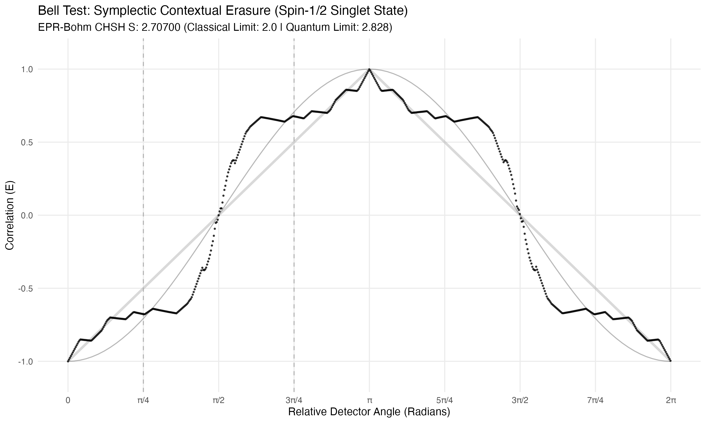

```{r setup-and-data, echo=FALSE, message=FALSE, warning=FALSE}
library(data.table)
library(ggplot2)
library(ggforce)
library(patchwork)

# --- 1. Configuration & Data Load ---
base_dir     <- "/Volumes/SanDisk4TB/SternBrocot-data"
erasures_dir <- file.path(base_dir, "01_erasures")
density_dir  <- file.path(base_dir, "02_erasure_distance_densities")
nodes_dir    <- file.path(base_dir, "03_erasure_distance_density_nodes")
summary_path <- file.path(base_dir, "04_erasure_distance_summary.csv.gz")

if (!file.exists(summary_path)) stop("Summary file not found at: ", summary_path)

dt_summary <- fread(summary_path)

# --- 2. Manual Selection Logic (Hand-Picked Momenta) ---
dt_handpicked <- data.table(
  normalized_momentum = c(0.5, 0.876, 1.065, 1.354, 1.991, 2.308, 2.467, 2.640, 2.829, 2.98, 3.268, 100.0),
  expected_nodes = c(0:10, 29)
)

# Rolling join to find the closest actual experimental data points
dt_selected <- dt_summary[dt_handpicked, on = .(normalized_momentum), roll = "nearest"]
```

```{r combined-grid-plot, echo=FALSE, fig.width=14, fig.height=25, warning=FALSE, message=FALSE}
# --- Plot 1: Combined Grayscale Small Multiples ---
render_combined_grid <- function(matches_dt) {
  plot_list <- list()
  
  for (i in seq_len(nrow(matches_dt))) {
    row <- matches_dt[i]
    q_val <- row$normalized_momentum
    q_str <- sprintf("%013.6f", q_val)
    
    # ---------------------------------------------------------
    # 1. Conjugate Quanta (Left Column)
    # ---------------------------------------------------------
    a_base <- q_val / 0.5
    b_base <- 0.5 / q_val
    scaling_factor <- 90 / max(a_base, b_base) 
    
    ellipse_df <- data.frame(
      type = factor(c("Q-Conjugate", "P-Conjugate"), levels = c("Q-Conjugate", "P-Conjugate")),
      major = c(a_base, b_base) * scaling_factor,
      minor = c(b_base, a_base) * scaling_factor
    )
    
    p_ell <- ggplot(ellipse_df) +
      geom_ellipse(aes(x0 = 0, y0 = 0, a = major, b = minor, angle = 0, color = type, fill = type), 
                   alpha = 0.2, linewidth = 0.5) +
      scale_fill_manual(values = c("Q-Conjugate" = "black", "P-Conjugate" = "gray60")) +
      scale_color_manual(values = c("Q-Conjugate" = "black", "P-Conjugate" = "gray30")) +
      coord_fixed(xlim = c(-100, 100), ylim = c(-100, 100)) +
      theme_minimal() + 
      theme(legend.position = "none",
            axis.title = element_blank(), 
            axis.text = element_blank(),
            panel.grid = element_line(color = "gray90"),
            aspect.ratio = 1,
            plot.margin = margin(5, 5, 5, 5))
    
    if (i == 1) p_ell <- p_ell + labs(title = "Conjugate Quanta") + 
        theme(plot.title = element_text(hjust = 0.5, face = "bold", size = 14))
    
    # ---------------------------------------------------------
    # 2. Microstate vs. Macrostate (Middle Column)
    # ---------------------------------------------------------
    f_path <- file.path(erasures_dir, sprintf("erasures_P_%s.csv.gz", q_str))
    p_scat <- ggplot() + theme_void() + theme(aspect.ratio = 1, plot.margin = margin(5, 5, 5, 5)) 
    
    if (file.exists(f_path)) {
      dt_found <- fread(f_path)[found == 1]
      if (nrow(dt_found) > 0) {
        p_scat <- ggplot(dt_found, aes(x = microstate, y = macrostate)) +
          geom_point(alpha = 0.25, size = 0.1, color = "black") + 
          theme_minimal() +
          theme(axis.title = element_blank(), 
                axis.text = element_blank(),
                panel.grid = element_line(color = "gray90"),
                aspect.ratio = 1,
                plot.margin = margin(5, 5, 5, 5))
      }
    }
    if (i == 1) p_scat <- p_scat + labs(title = "Macrostates vs. Microstates") + 
        theme(plot.title = element_text(hjust = 0.5, face = "bold", size = 14))
    
    # ---------------------------------------------------------
    # 3. Coordinate Density (Right Column)
    # ---------------------------------------------------------
    d_path <- file.path(density_dir, sprintf("erasure_distance_density_P_%s.csv.gz", q_str))
    n_path <- file.path(nodes_dir, sprintf("erasure_distance_nodes_P_%s.csv.gz", q_str))
    
    p_den <- ggplot() + theme_void() + theme(aspect.ratio = 1, plot.margin = margin(5, 5, 5, 5))
    
    if (file.exists(d_path)) {
      h_pts <- fread(d_path)
      dt_active <- h_pts[density_count > 0]
      if (nrow(dt_active) > 0) {
        max_h <- max(dt_active$density_count, na.rm = TRUE)
        q_diff_raw <- if(nrow(dt_active) > 1) median(diff(dt_active$coordinate_q), na.rm=TRUE) else 1.0
        max_q_edge <- max(abs(dt_active$coordinate_q), na.rm = TRUE) + (q_diff_raw / 2)
        
        dt_active[, c("pct_density", "pct_q") := list((density_count/max_h)*100, (coordinate_q/max_q_edge)*100)]
        pct_width <- (q_diff_raw / max_q_edge) * 100
        
        h_plot_data <- rbind(
          data.table(pct_q = min(dt_active$pct_q) - pct_width, pct_density = 0),
          dt_active[, .(pct_q, pct_density)],
          data.table(pct_q = max(dt_active$pct_q) + pct_width, pct_density = 0)
        )
        
        n_pts <- if(file.exists(n_path)) fread(n_path) else data.table()
        if (nrow(n_pts) > 0 && "coordinate_q" %in% names(n_pts)) {
          n_pts[, c("pct_density", "pct_q") := list((density_count/max_h)*100, (coordinate_q/max_q_edge)*100)]
        }
        
        p_den <- ggplot() +
          geom_col(data = dt_active, aes(x = pct_q, y = pct_density), width = pct_width, fill = "gray85") +
          geom_step(data = h_plot_data, aes(x = pct_q, y = pct_density), color = "black", linewidth = 0.5, direction = "mid") + 
          geom_point(data = n_pts, aes(x = pct_q, y = pct_density), color = "black", size = 1.5) +
          coord_cartesian(xlim = c(-100, 100), ylim = c(0, 105)) +
          theme_minimal() +
          theme(axis.title = element_blank(), 
                axis.text = element_blank(),
                panel.grid = element_line(color = "gray90"),
                aspect.ratio = 1,
                plot.margin = margin(5, 5, 5, 5))
      }
    }
    if (i == 1) p_den <- p_den + labs(title = "Coordinate Density") + 
        theme(plot.title = element_text(hjust = 0.5, face = "bold", size = 14))
    
    # ---------------------------------------------------------
    # 4. Append row to Master List
    # ---------------------------------------------------------
    plot_list[[length(plot_list) + 1]] <- p_ell
    plot_list[[length(plot_list) + 1]] <- p_scat
    plot_list[[length(plot_list) + 1]] <- p_den
  }
  
  # ---------------------------------------------------------
  # Assemble into Final Matrix using Patchwork
  # ---------------------------------------------------------
  final_grid <- wrap_plots(plot_list, ncol = 3) +
    plot_annotation(
      title = "Structural Evolution of the Harmonic States",
      subtitle = "Nodes 0 through 10 rendered in strict grayscale phase space",
      theme = theme(plot.title = element_text(size = 20, face = "bold", hjust = 0.5, family = "mono"),
                    plot.subtitle = element_text(size = 14, hjust = 0.5, color = "gray30"))
    )
  
  print(final_grid)
}

# Execute the plot
render_combined_grid(dt_selected)
```

---



---

```{r overview-scatter-plot, echo=FALSE, results='asis', message=FALSE, warning=FALSE, fig.width=12, fig.height=8}
# --- Plot 2: Overview Scatter Plot (Filtered to Nodes 0-10) ---
qho_backbone <- function(P) { P^2 }

dt_plot_bg <- dt_summary[node_count >= 0 & node_count <= 10]

p_ov_action <- ggplot() +
  stat_function(fun = qho_backbone, 
                n = 1001, 
                color = "black", 
                linetype = "dashed", 
                alpha = 0.5, 
                linewidth = 0.8) +
  geom_point(data = dt_plot_bg[order(complexity_ntv)], 
             aes(x = normalized_momentum, y = node_count, color = complexity_ntv), 
             size = 1.5, alpha = 0.6) +
  scale_color_gradient(low = "black", high = "grey80", name = "Variation") +  
  geom_point(data = dt_selected, aes(x = normalized_momentum, y = node_count), 
             color = "black", size = 5, shape = 21, fill = NA, stroke = 1.2) +
  geom_text(data = dt_selected, aes(x = normalized_momentum, y = node_count, 
            label = sprintf("n=%d P=%.3f v=%.2f", node_count, normalized_momentum, complexity_ntv)),
            nudge_y = 0.35, size = 3, fontface = "bold", family = "mono") +
  labs(title = "Node Count and Momentum: Hand-Picked States (0-10)",
       subtitle = "Selection constrained to the first 10 harmonic nodes",
       x = "Normalized Momentum (P)", y = "Nodes (n)") +
  scale_y_continuous(breaks = 0:10) +
  coord_cartesian(xlim = c(0.4, 3.5), ylim = c(-0.5, 11)) +
  theme_minimal() +
  theme(panel.grid.minor = element_blank(), plot.title = element_text(face = "bold", size = 14))

print(p_ov_action)
cat("\n\n---\n\n")
```

```{r individual-detail-plots, echo=FALSE, results='asis', message=FALSE, warning=FALSE, fig.width=10, fig.height=6}
# --- Plot 3: Profiles ---
render_profiles <- function(matches_dt, dot_color = "black") {
  for (i in seq_len(nrow(matches_dt))) {
    row <- matches_dt[i]
    q_val <- row$normalized_momentum
    q_str <- sprintf("%013.6f", q_val) # Standardized formatting
    
    d_path <- file.path(density_dir, sprintf("erasure_distance_density_P_%s.csv.gz", q_str))
    n_path <- file.path(nodes_dir, sprintf("erasure_distance_nodes_P_%s.csv.gz", q_str))

    if (file.exists(d_path)) {
      h_pts <- fread(d_path)
      dt_active <- h_pts[density_count > 0]
      if (nrow(dt_active) == 0) next

      max_h <- max(dt_active$density_count, na.rm = TRUE)
      q_diff_raw <- if(nrow(dt_active) > 1) median(diff(dt_active$coordinate_q), na.rm=TRUE) else 1.0
      max_q_edge <- max(abs(dt_active$coordinate_q), na.rm = TRUE) + (q_diff_raw / 2)
      
      # Safe assignment
      dt_active[, c("pct_density", "pct_q") := list((density_count/max_h)*100, (coordinate_q/max_q_edge)*100)]
      pct_width <- (q_diff_raw / max_q_edge) * 100
      
      h_plot_data <- rbind(
        data.table(pct_q = min(dt_active$pct_q) - pct_width, pct_density = 0),
        dt_active[, .(pct_q, pct_density)],
        data.table(pct_q = max(dt_active$pct_q) + pct_width, pct_density = 0)
      )

      n_pts <- if(file.exists(n_path)) fread(n_path) else data.table()
      if (nrow(n_pts) > 0 && "coordinate_q" %in% names(n_pts)) {
        n_pts[, c("pct_density", "pct_q") := list((density_count/max_h)*100, (coordinate_q/max_q_edge)*100)]
      }
      
      p <- ggplot() +
        geom_col(data = dt_active, aes(x = pct_q, y = pct_density), width = pct_width, fill = "grey85") +
        geom_step(data = h_plot_data, aes(x = pct_q, y = pct_density), color = "black", linewidth = 0.7, direction = "mid") + 
        geom_point(data = n_pts, aes(x = pct_q, y = pct_density), color = dot_color, size = 3) +
        labs(title = sprintf("Nodes: %02d | P: %3.3f | NTV: %2.2f", row$node_count, q_val, row$complexity_ntv),
             x = "Amplitude (%)", y = "Density %") +
        coord_cartesian(xlim = c(-100, 100), ylim = c(0, 105)) +
        scale_x_continuous(breaks = seq(-100, 100, 50)) +
        scale_y_continuous(expand = c(0, 0)) +
        theme_minimal() +
        theme(plot.title = element_text(family = "mono", face = "bold", size = 11))
      
      print(p)
      cat("\n\n---\n\n")
    }
  }
}
render_profiles(dt_selected, "black")

# --- Plot 4: Micro Macro ---
render_micro_macro_scatters <- function(matches_dt) {
  for (i in seq_len(nrow(matches_dt))) {
    row <- matches_dt[i]
    q_val <- row$normalized_momentum
    q_str <- sprintf("%013.6f", q_val)
    f_path <- file.path(erasures_dir, sprintf("erasures_P_%s.csv.gz", q_str))
    
    if (file.exists(f_path)) {
      dt_found <- fread(f_path)[found == 1]
      if (nrow(dt_found) == 0) next
      
      p <- ggplot(dt_found, aes(x = microstate, y = macrostate)) +
        geom_point(alpha = 0.4, size = 0.5, color = "black") +
        labs(title = sprintf("Phase Space Erasure: P = %.6f", q_val),
             subtitle = sprintf("Nodes: %d | Range: [%.3f, %.3f]", 
                               row$node_count, min(dt_found$microstate), max(dt_found$microstate)),
             x = "Microstate", y = "Macrostate") +
        theme_minimal() +
        theme(plot.title = element_text(family = "mono", face = "bold"))
      
      print(p)
      cat("\n\n---\n\n")
    }
  }
}
render_micro_macro_scatters(dt_selected)

# --- Plot 5: Conjugate Ellipses ---
render_ellipses <- function(matches_dt) {
  for (i in seq_len(nrow(matches_dt))) {
    row <- matches_dt[i]
    q_val <- row$normalized_momentum
    a_base <- q_val / 0.5
    b_base <- 0.5 / q_val
    scaling_factor <- 90 / max(a_base, b_base) 
    
    ellipse_df <- data.frame(
      type = c("Q-Conjugate", "P-Conjugate"),
      major = c(a_base, b_base) * scaling_factor,
      minor = c(b_base, a_base) * scaling_factor
    )

    p <- ggplot(ellipse_df) +
      geom_ellipse(aes(x0 = 0, y0 = 0, a = major, b = minor, angle = 0, color = type, fill = type), 
                   alpha = 0.25, linewidth = 0.8) +
      scale_fill_manual(values = c("Q-Conjugate" = "black", "P-Conjugate" = "gray60")) +
      scale_color_manual(values = c("Q-Conjugate" = "black", "P-Conjugate" = "gray40")) +
      labs(title = sprintf("Momentum: %3.3f", q_val),
           subtitle = "Action Quanta", x = "q", y = "p") +
      coord_fixed(xlim = c(-100, 100), ylim = c(-100, 100)) +
      theme_minimal() + theme(legend.position = "none", aspect.ratio = 1)

    print(p)
    cat("\n\n---\n\n")
  }
}
render_ellipses(dt_selected)
```
