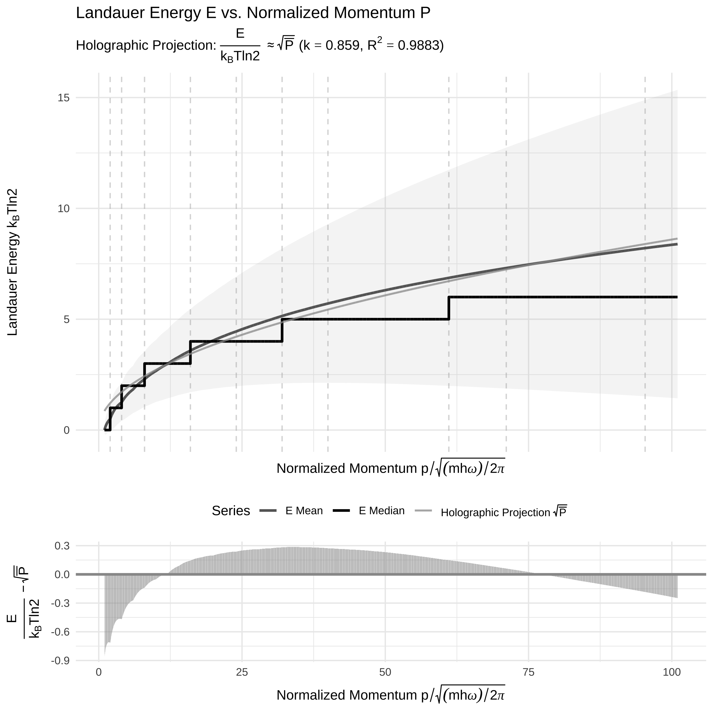

Stern-Brocot Physics
================

An R package for computational experiments in classical and quantum
physics using the Stern-Brocot tree. \### Fit Statistics: Holographic
Theory ($E \propto \sqrt{P}$)

The quantitative analysis of the physical data ($P \ge 1.0$) provides
strong evidence that the **Landauer Energy** best aligns with the
hypothesized **holographic principle** scaling.

| Metric                  | k_constant | R_squared | Correlation_R |   RMSE |
|:------------------------|-----------:|----------:|--------------:|-------:|
| Landauer vs Holographic |       0.63 |    0.7201 |        0.9992 | 0.4417 |

<!-- -->

<!-- -->

<!-- -->
