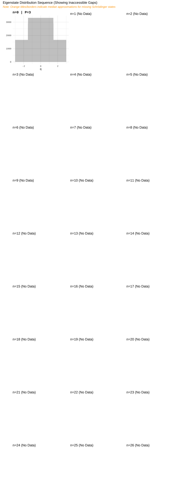
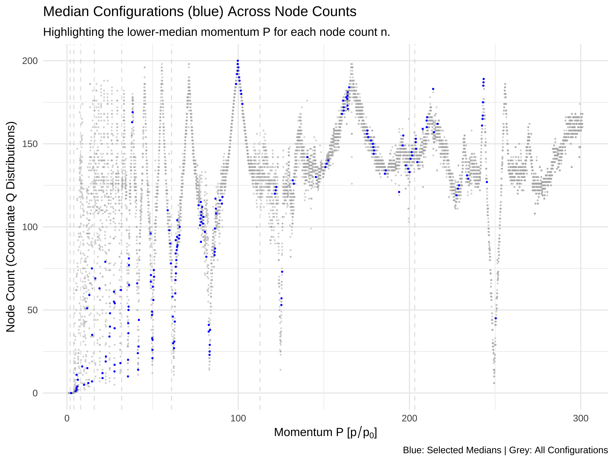
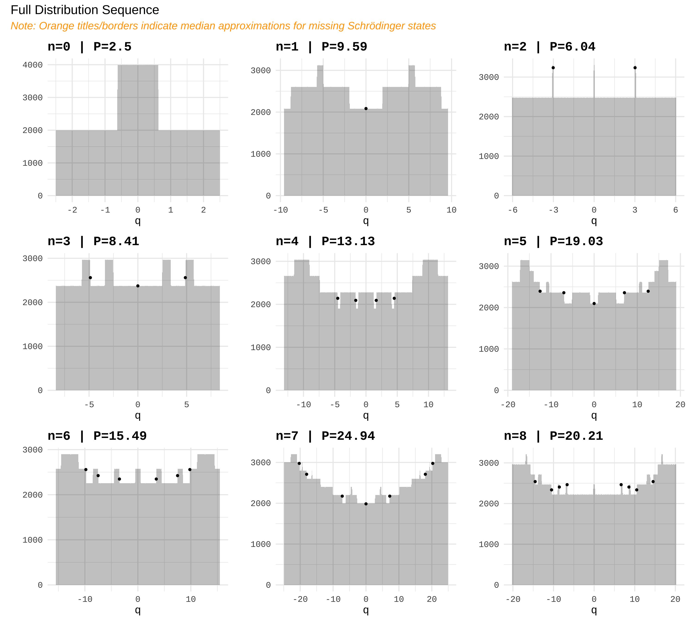
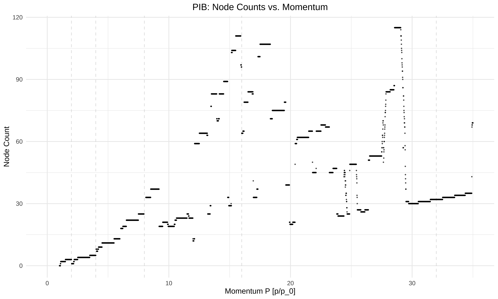
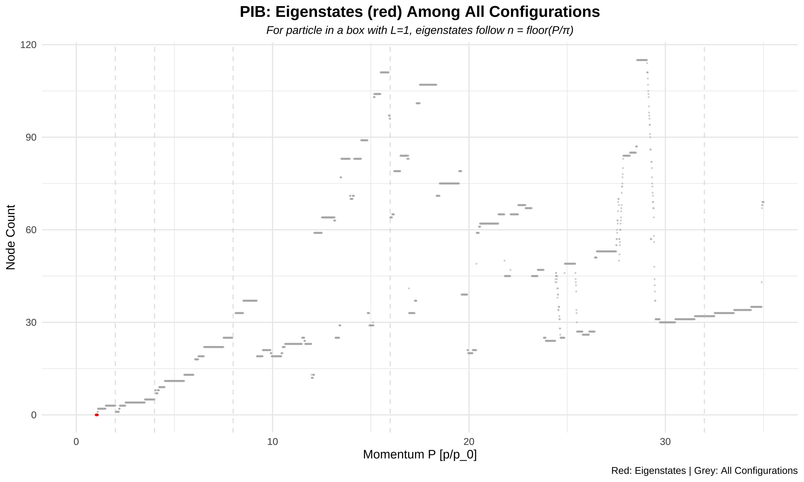
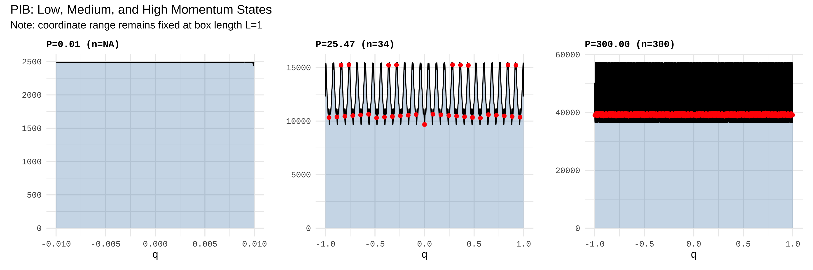

Stern-Brocot Physics
================

# Stern-Brocot Physics

## Quantum Harmonic Oscillator

An R package for computational experiments in classical and quantum
physics using the Stern-Brocot tree.

<!-- -->

<!-- -->

<!-- -->

<!-- -->

<!-- -->

<!-- -->

<!-- -->

<!-- -->

# Ellipse Parameterization (A = PQ)

This visualization shows two overlapping ellipses centered at (0,0)
where $A = PQ$.

<!-- -->

## Particle in a Box

# Particle in a Box Analysis

The particle in a box has a fixed spatial extent L=1, but momentum can
increase indefinitely. Unlike the quantum harmonic oscillator where both
P and Q scale together, here the coordinate remains bounded while
momentum grows.

## Complexity vs Momentum

<!-- -->

## Node Count vs Momentum

<!-- -->

## Eigenstate Identification

<!-- -->

## Sample Coordinate Distributions

<!-- -->

## Low vs High Momentum Comparison

<!-- -->
