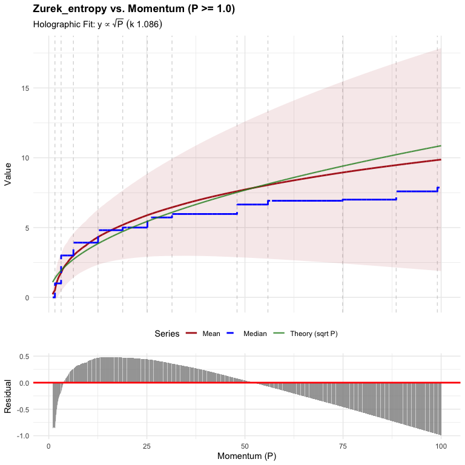
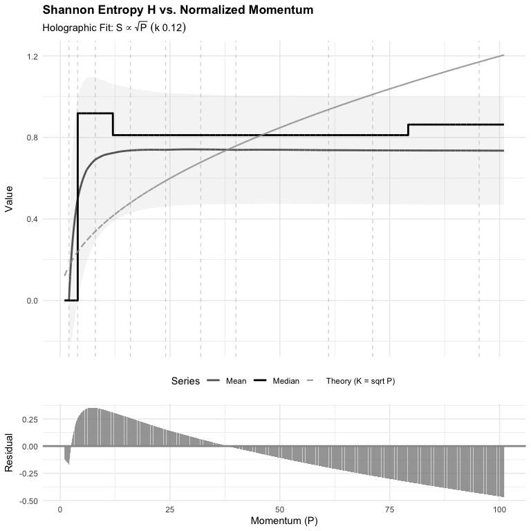
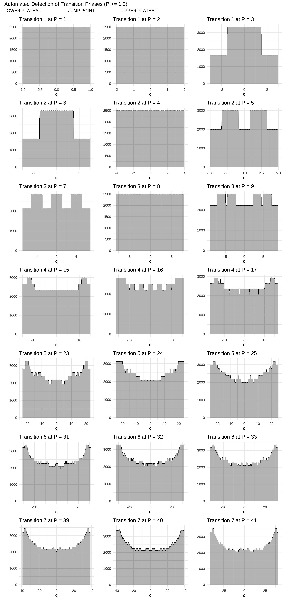

Stern-Brocot Physics
================

An R package for computational experiments in classical and quantum
physics using the Stern-Brocot tree. \### Fit Statistics: Holographic
Theory ($S ~ \sqrt{P}$)

The quantitative analysis of the physical data ($P \ge 1.0$) provides
strong evidence that the **Zurek entropy** best aligns with the
hypothesized **holographic principle** scaling.

| Label                 | k_constant | R_squared | Correlation_R | RMSE   |
|:----------------------|:-----------|:----------|:--------------|:-------|
| Zurek Entropy         | 0.979      | 0.9689    | 0.9908        | 0.3604 |
| Kolmogorov Complexity | 0.859      | 0.9883    | 0.9946        | 0.2156 |
| Shannon Entropy       | 0.12       | -6.0703   | 0.4732        | 0.2627 |

The Zurek and Kolmogorov complexity metrics both exhibit outstanding
fits to the theory curve. In contrast, the Shannon entropy metric yields
a very poor fit, confirming it is likely the source of the structured,
“quantized” deviations.

<!-- --><!-- --><!-- -->

<!-- -->

<!-- -->

<!-- -->
