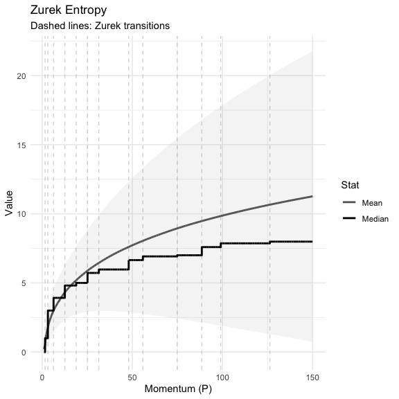
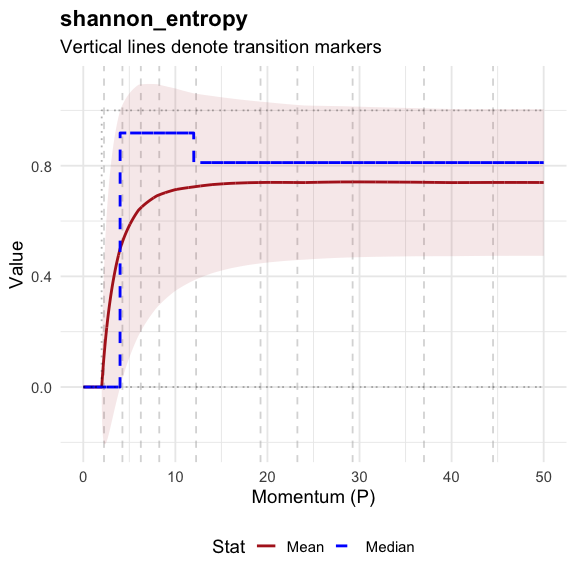
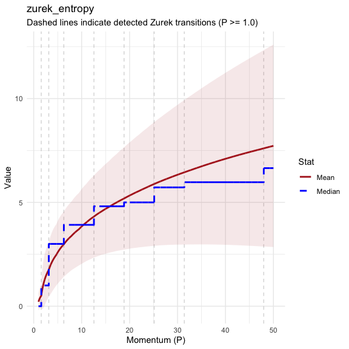
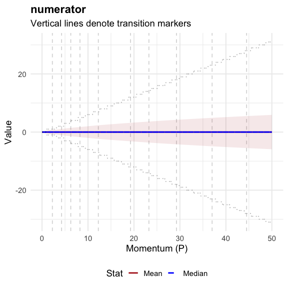
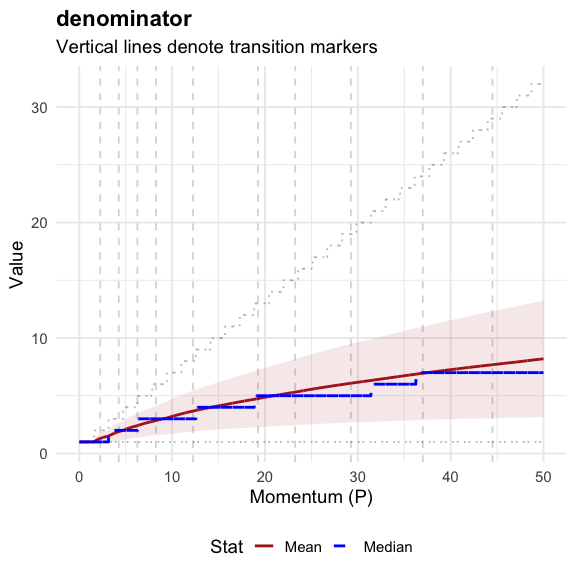
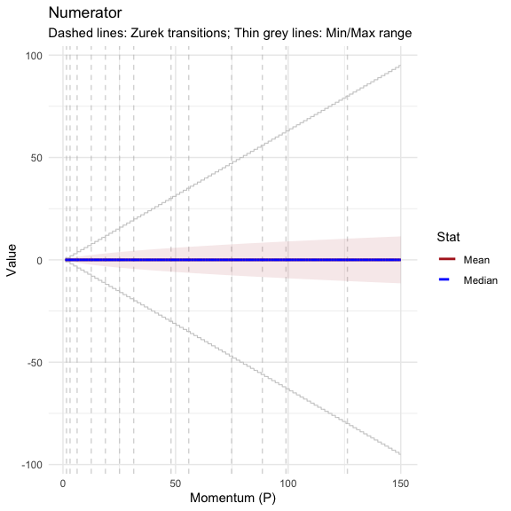
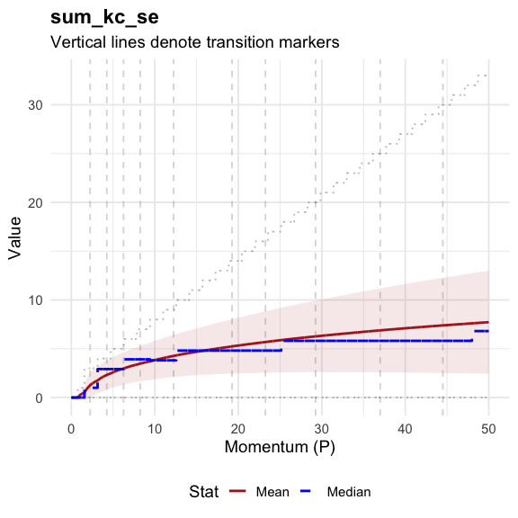
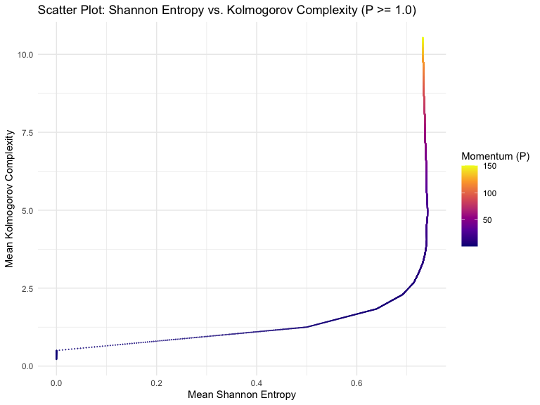

Stern-Brocot Physics
================

An R package for computational experiments in classical and quantum
physics using the Stern-Brocot tree.

<!-- --><!-- --><!-- --><!-- --><!-- --><!-- --><!-- -->

<!-- -->

<!-- -->

<!-- -->

<!-- -->

<!-- -->

<!-- -->

<!-- -->

<!-- -->

<!-- -->

<!-- -->

<!-- -->

| Momentum (P) | Median K (n) | Max K (Action) | Avg Entropy |
|-------------:|-------------:|---------------:|------------:|
|         0.01 |            0 |              0 |      0.0000 |
|         0.16 |            0 |              0 |      0.0000 |
|         0.32 |            0 |              0 |      0.0000 |
|         0.48 |            0 |              0 |      0.0000 |
|         0.63 |            0 |              0 |      0.0000 |
|         0.79 |            0 |              0 |      0.0000 |
|         0.95 |            0 |              0 |      0.0000 |
|        24.11 |            4 |             13 |      0.7391 |
|        24.26 |            4 |             13 |      0.7393 |
|        24.42 |            4 |             13 |      0.7394 |
|        24.58 |            4 |             13 |      0.7395 |
|        24.74 |            4 |             13 |      0.7396 |
|        24.89 |            4 |             13 |      0.7397 |
|        25.05 |            4 |             13 |      0.7398 |
|        25.21 |            4 |             13 |      0.7399 |
|        25.37 |            4 |             13 |      0.7400 |
|        25.52 |            4 |             13 |      0.7401 |
|        25.68 |            4 |             13 |      0.7402 |
|        25.84 |            4 |             13 |      0.7403 |
|        26.00 |            4 |             13 |      0.7404 |

Correspondence Table: Extended Momentum vs. Algorithmic Depth

<!-- -->
<!-- -->
