Stern-Brocot Physics
================

An R package for computational experiments in classical and quantum
physics using the Stern-Brocot tree.

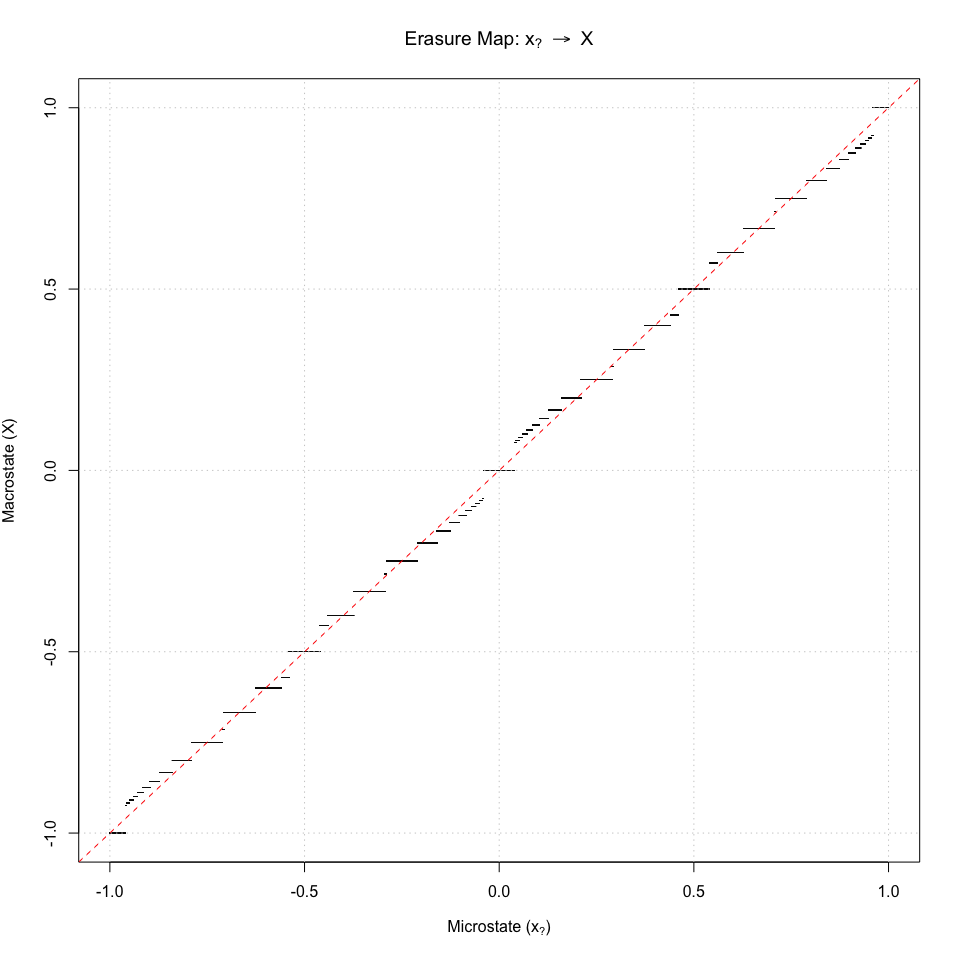<!-- -->

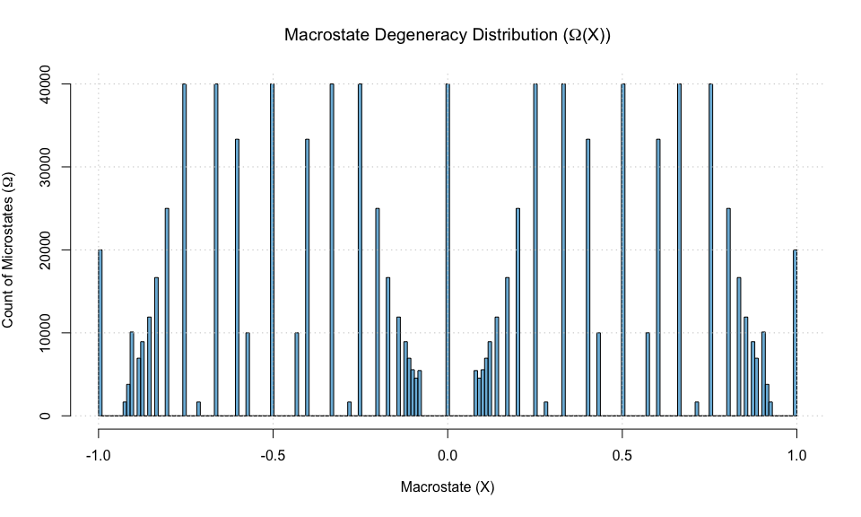<!-- -->

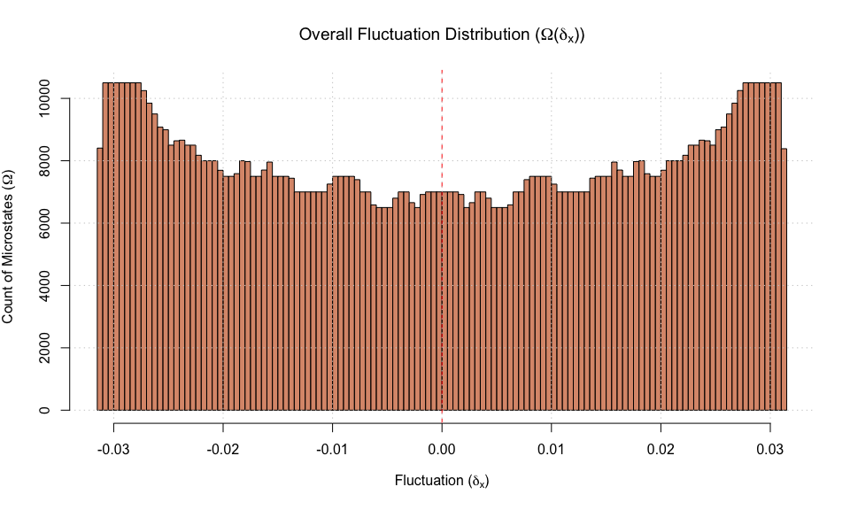<!-- -->

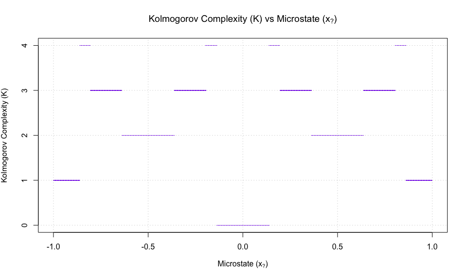<!-- -->

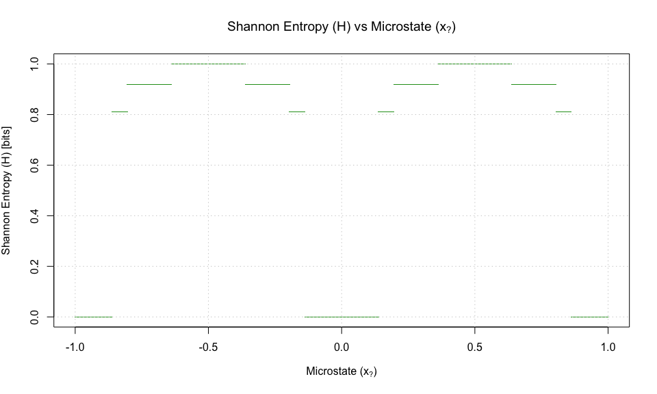<!-- -->

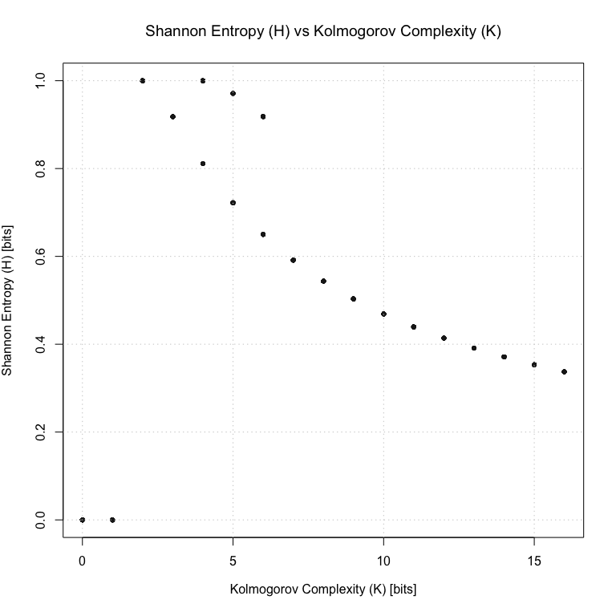<!-- -->

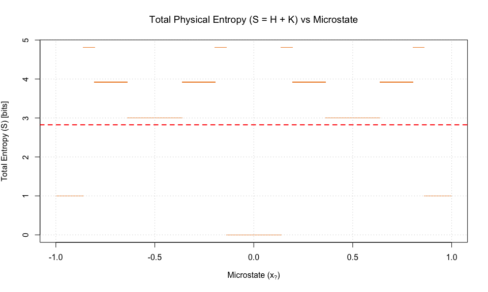<!-- -->

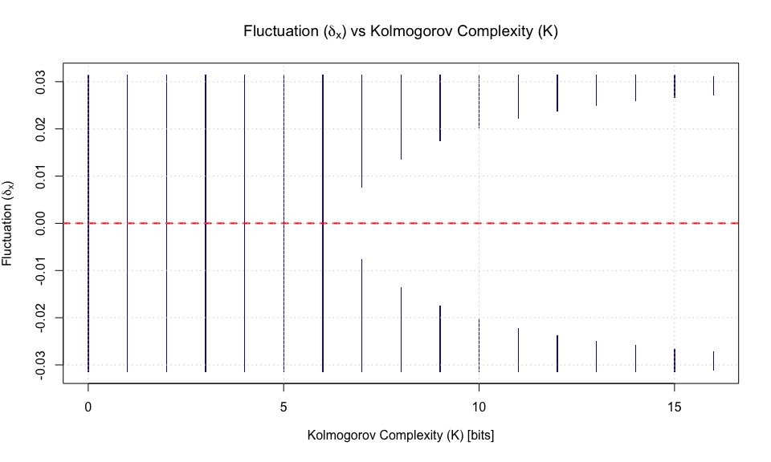<!-- -->

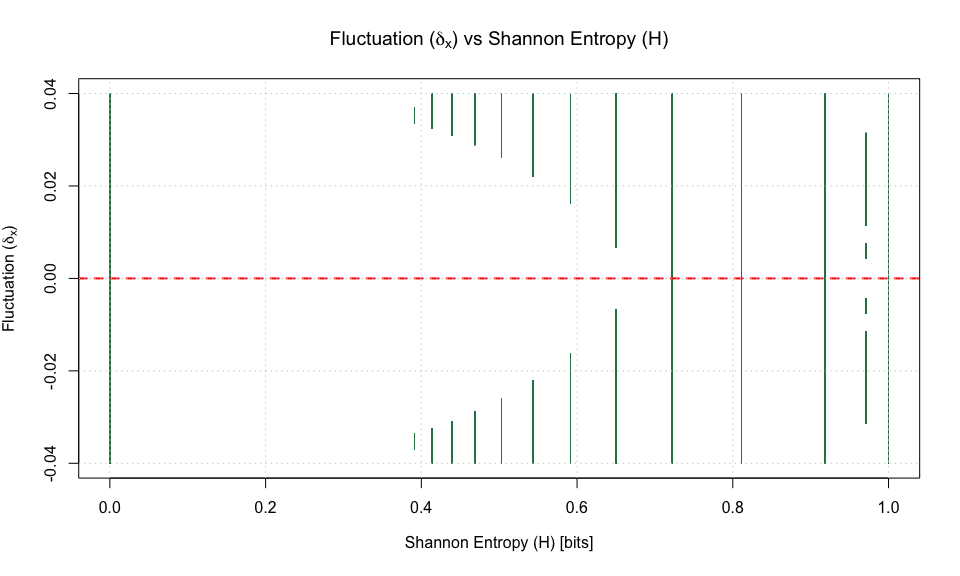<!-- -->

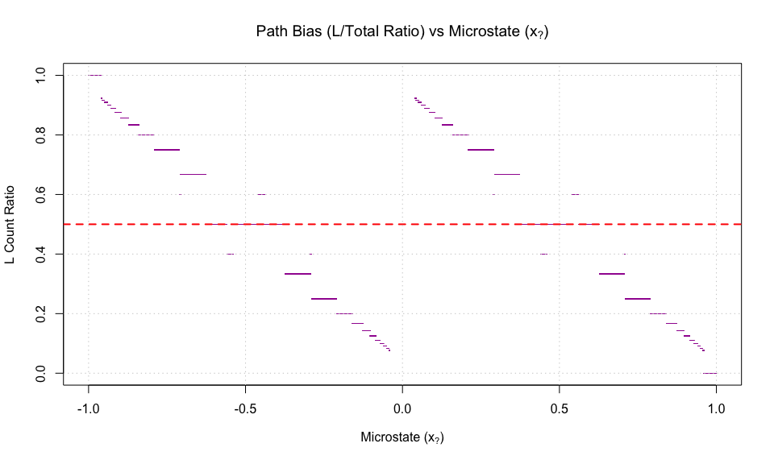<!-- -->

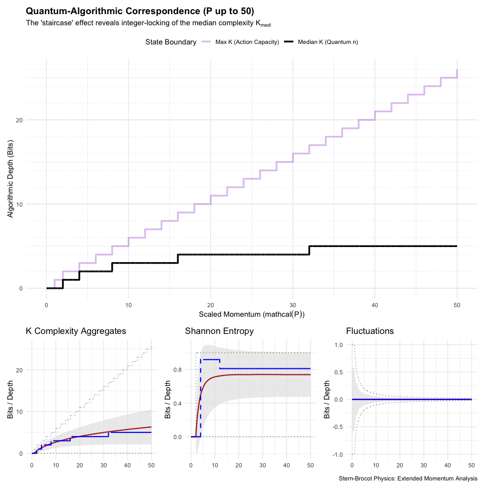<!-- -->

| Momentum (P) | Median K (n) | Max K (Action) | Avg Entropy |
|-------------:|-------------:|---------------:|------------:|
|         0.01 |            0 |              0 |      0.0000 |
|         2.64 |            1 |              2 |      0.2424 |
|         5.27 |            2 |              3 |      0.6008 |
|         7.90 |            2 |              4 |      0.6893 |
|        10.53 |            3 |              6 |      0.7165 |
|        13.16 |            3 |              7 |      0.7286 |
|        15.79 |            3 |              8 |      0.7358 |
|        18.42 |            4 |             10 |      0.7389 |
|        21.05 |            4 |             11 |      0.7396 |
|        23.68 |            4 |             12 |      0.7391 |
|        26.32 |            4 |             14 |      0.7406 |
|        28.95 |            4 |             15 |      0.7414 |
|        31.58 |            4 |             16 |      0.7412 |
|        34.21 |            5 |             18 |      0.7408 |
|        36.84 |            5 |             19 |      0.7401 |
|        39.47 |            5 |             20 |      0.7392 |
|        42.10 |            5 |             22 |      0.7392 |
|        44.73 |            5 |             23 |      0.7395 |
|        47.36 |            5 |             24 |      0.7395 |
|        50.00 |            5 |             26 |      0.7393 |

Correspondence Table: Extended Momentum vs. Algorithmic Depth

<!-- -->
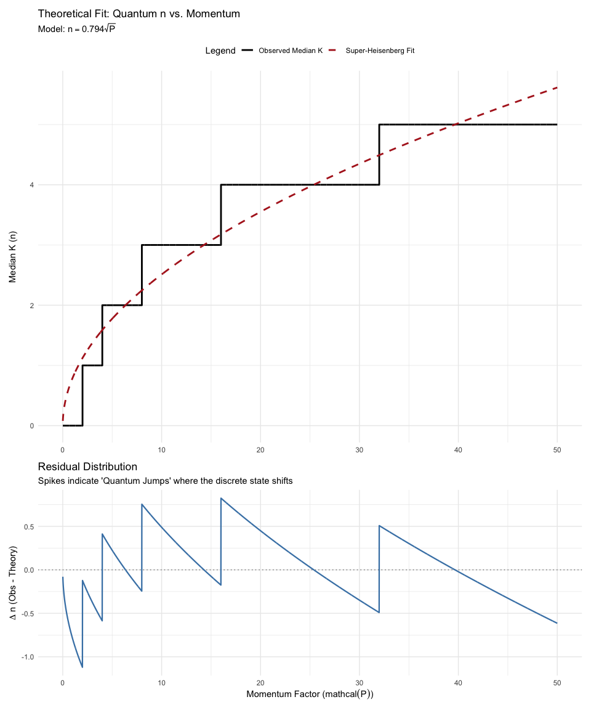<!-- -->

<!-- -->
