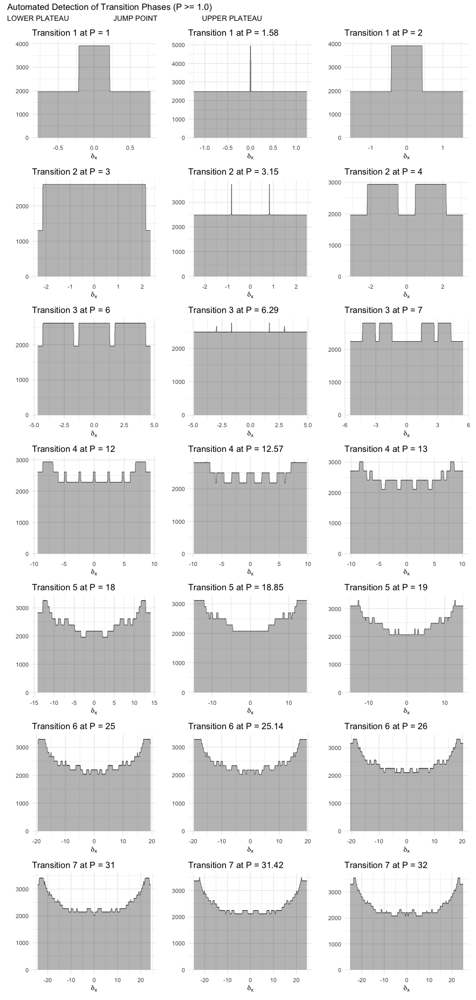

Stern-Brocot Physics
================

An R package for computational experiments in classical and quantum
physics using the Stern-Brocot tree.

<!-- --><!-- --><!-- -->

### Fit Statistics: Holographic Theory ($S \propto \sqrt{P}$)

This section summarizes the goodness-of-fit for the mean values of
Shannon, Kolmogorov, and Zurek entropies against the proposed
holographic scaling relation for physical momentum values ($P
The quantitative analysis of the physical data ($P \$) provides strong
evidence that the **Zurek entropy** best aligns with the hypothesized
**holographic principle** scaling.

The Zurek and Kolmogorov complexity metrics both exhibit outstanding
fits to the $y \propto \sqrt{P}$ theory curve, with R-squared ($R^2$)
values exceeding 0.97. This suggests that the algorithmic information
and erasure metrics strongly adhere to this theoretical scaling behavior
within the physical regime. In contrast, the Shannon entropy metric
yields a very poor fit to the same model, confirming the visual
observation that the Shannon component is likely the source of the
structured, “quantized” deviations from the continuous holographic
theory curve.

\$).

| Metric                | k_constant | R_squared | Correlation_R | RMSE   |
|:----------------------|:-----------|:----------|:--------------|:-------|
| Shannon Entropy       | 0.238      | 0.7368    | 0.8993        | 0.1109 |
| Zurek Entropy         | 1.056      | 0.8375    | 0.9929        | 0.4037 |
| Kolmogorov Complexity | 0.818      | 0.8306    | 0.9993        | 0.3295 |

<!-- -->

<!-- -->

<!-- -->
