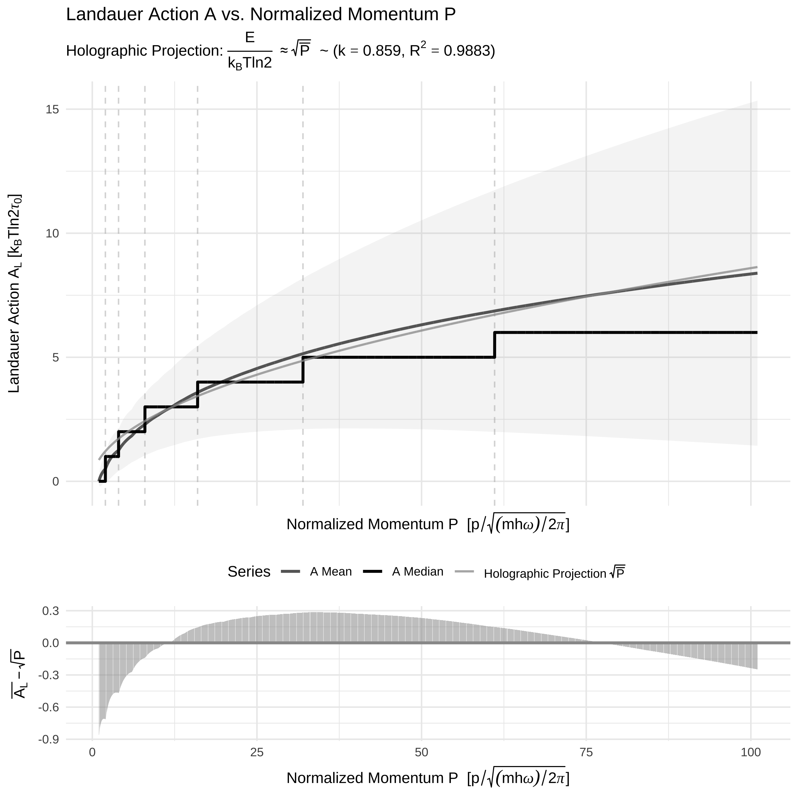

Stern-Brocot Physics
================

An R package for computational experiments in classical and quantum
physics using the Stern-Brocot tree.

### Fit Statistics: Holographic Theory ($A \propto \sqrt{P}$)

The quantitative analysis of the physical data ($P \ge 1.0$) provides
strong evidence that the **Landauer Action** best aligns with the
hypothesized **holographic principle** scaling.

| Metric                  | k_constant | R_squared | Correlation_R |   RMSE |
|:------------------------|-----------:|----------:|--------------:|-------:|
| Landauer vs Holographic |      0.859 |    0.9883 |        0.9946 | 0.2156 |

<!-- -->

<!-- -->

<!-- -->

# Ellipse Parameterization (A = PQ)

This visualization shows two overlapping ellipses centered at (0,0)
where $A = PQ$.

<!-- -->
