Stern-Brocot Physics: Observed Node Distribution
================

# 1. Summary: Raw Node Count Evolution

This plot is generated directly from the processed data files. It
contains no theoretical models or hardcoded coordinate ranges.

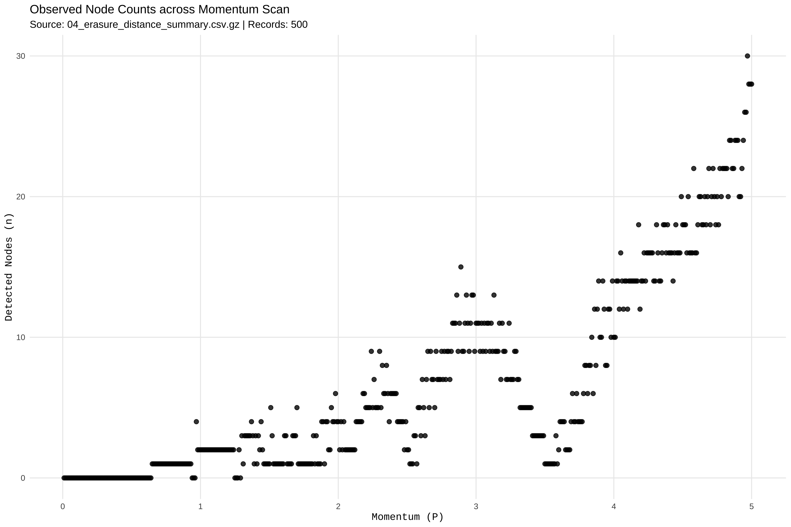<!-- -->
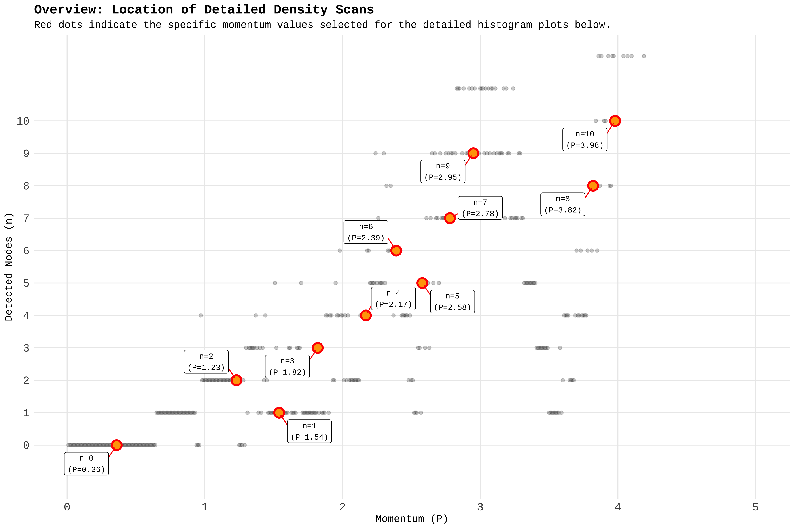<!-- -->

### Node Count n=0 (P=0.3600)

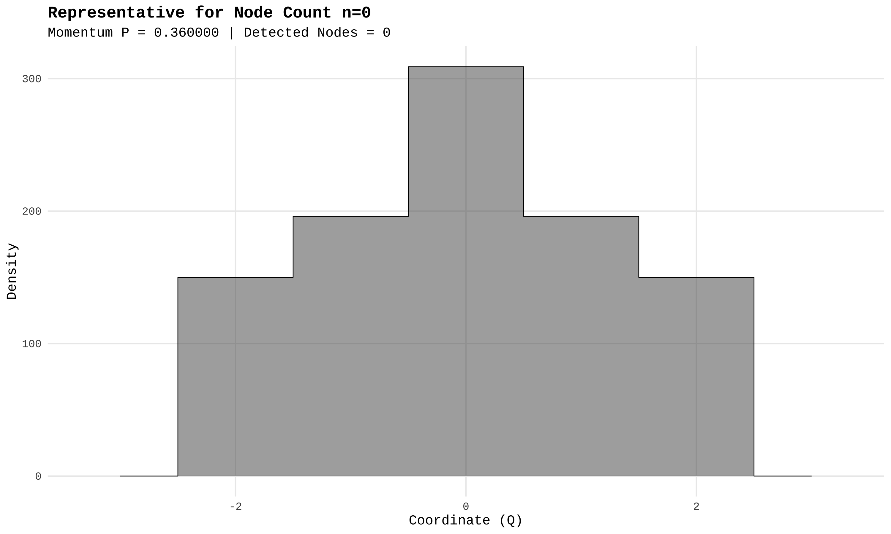<!-- -->

------------------------------------------------------------------------

### Node Count n=1 (P=1.5400)

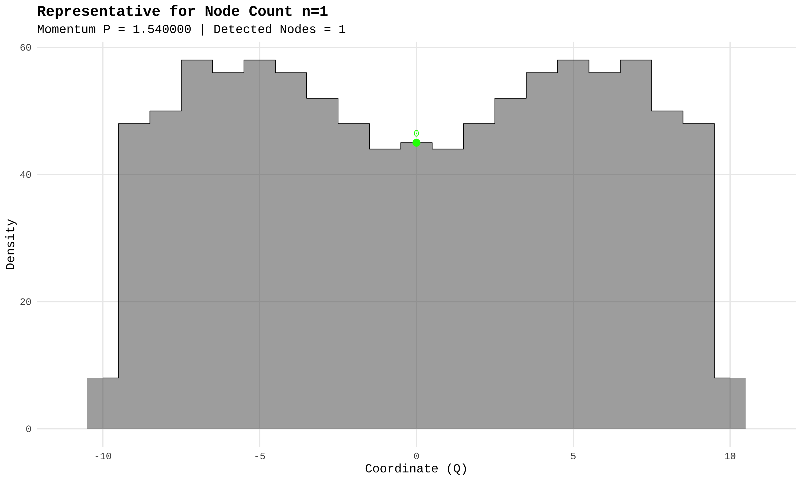<!-- -->

------------------------------------------------------------------------

### Node Count n=2 (P=1.2300)

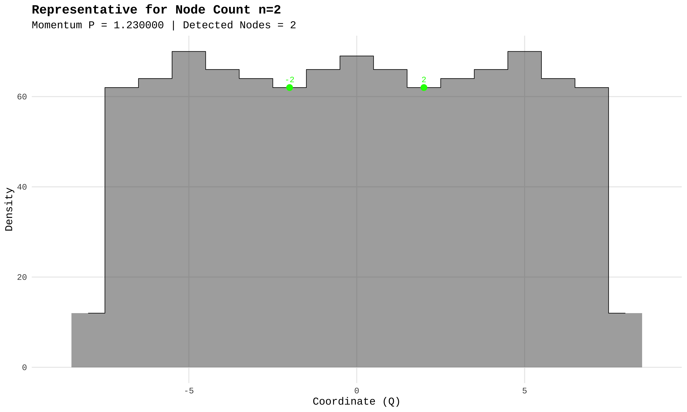<!-- -->

------------------------------------------------------------------------

### Node Count n=3 (P=1.8200)

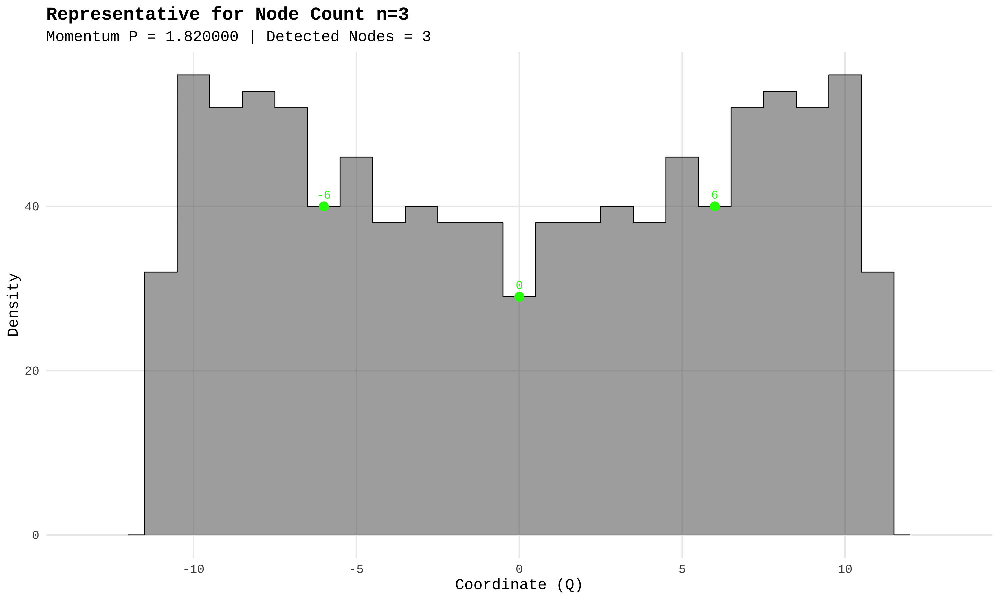<!-- -->

------------------------------------------------------------------------

### Node Count n=4 (P=2.1700)

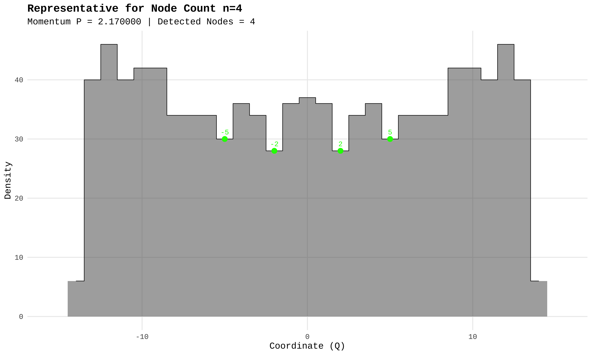<!-- -->

------------------------------------------------------------------------

### Node Count n=5 (P=2.5800)

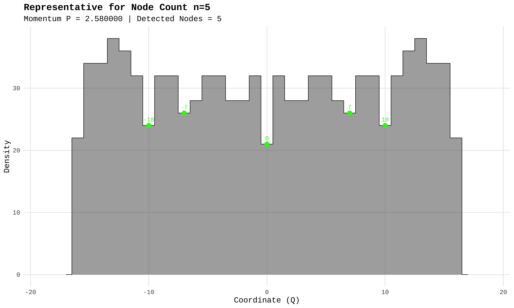<!-- -->

------------------------------------------------------------------------

### Node Count n=6 (P=2.3900)

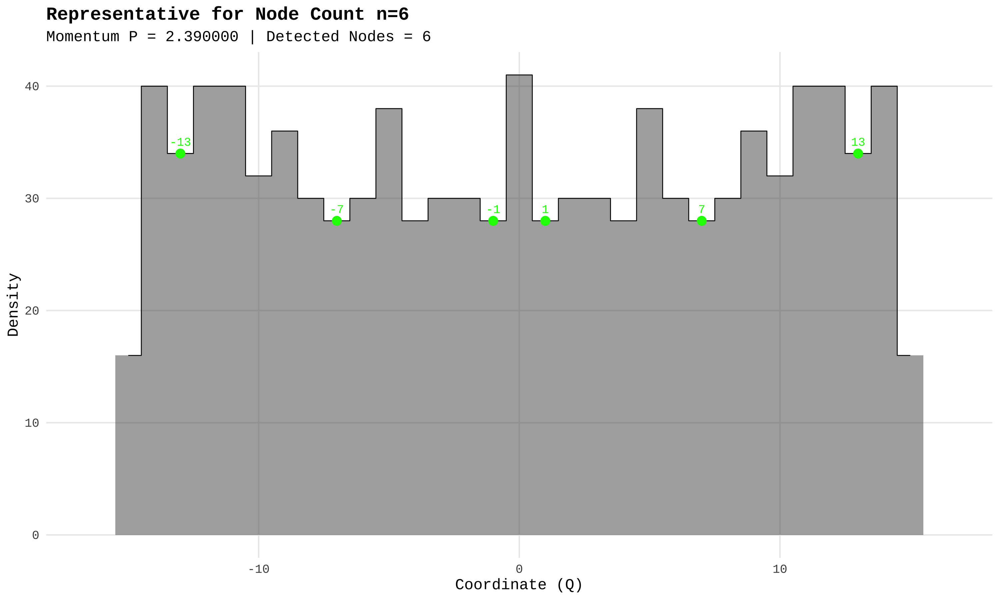<!-- -->

------------------------------------------------------------------------

### Node Count n=7 (P=2.7800)

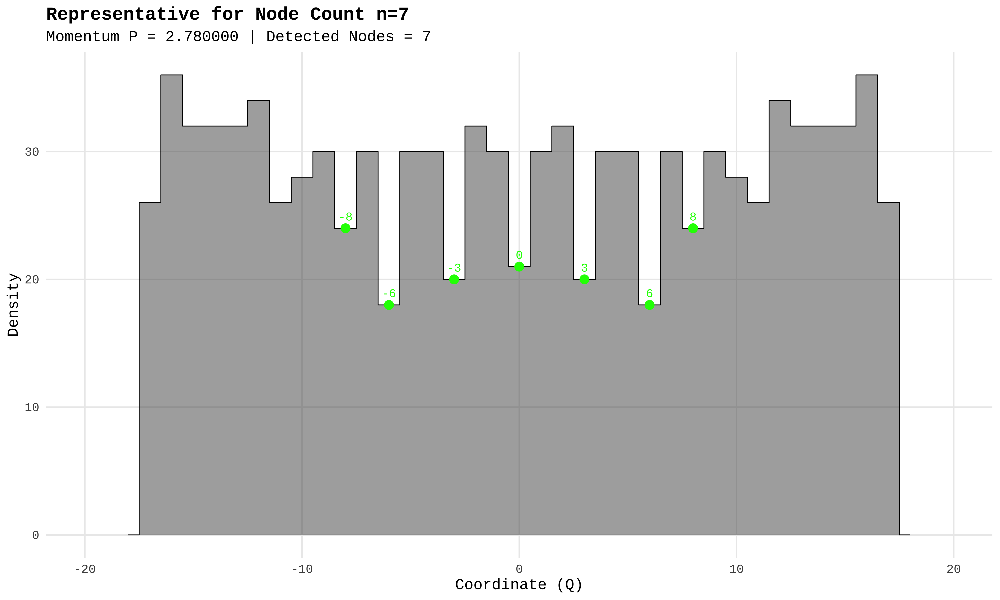<!-- -->

------------------------------------------------------------------------

### Node Count n=8 (P=3.8200)

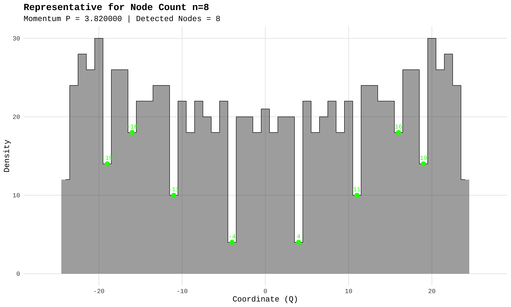<!-- -->

------------------------------------------------------------------------

### Node Count n=9 (P=2.9500)

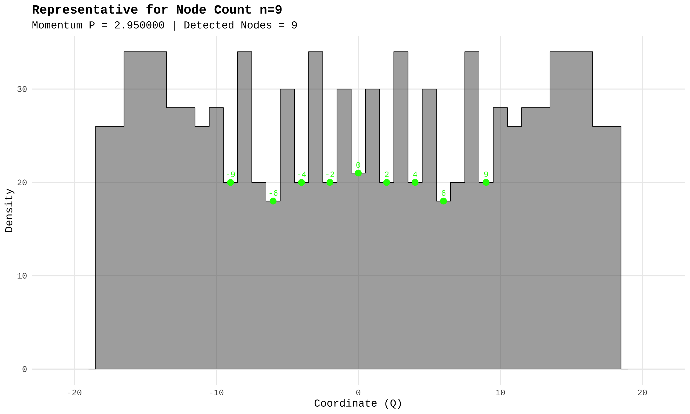<!-- -->

------------------------------------------------------------------------

### Node Count n=10 (P=3.9800)

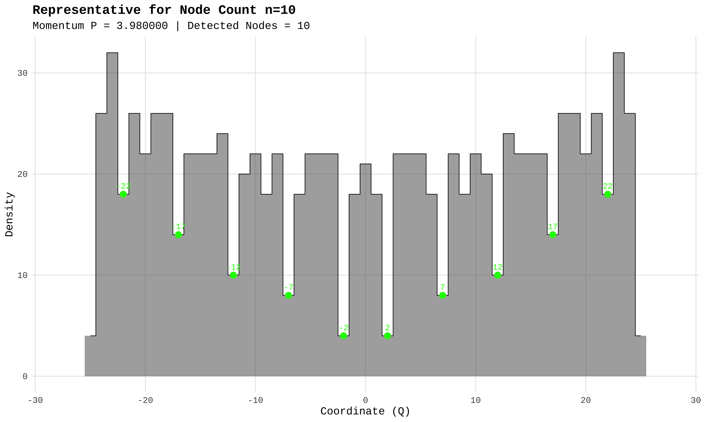<!-- -->

------------------------------------------------------------------------
