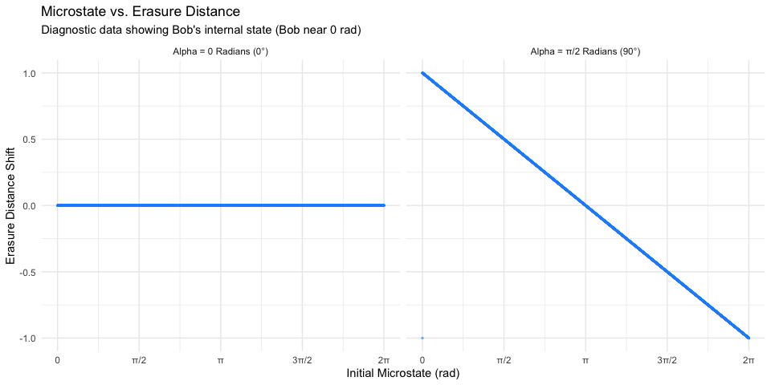
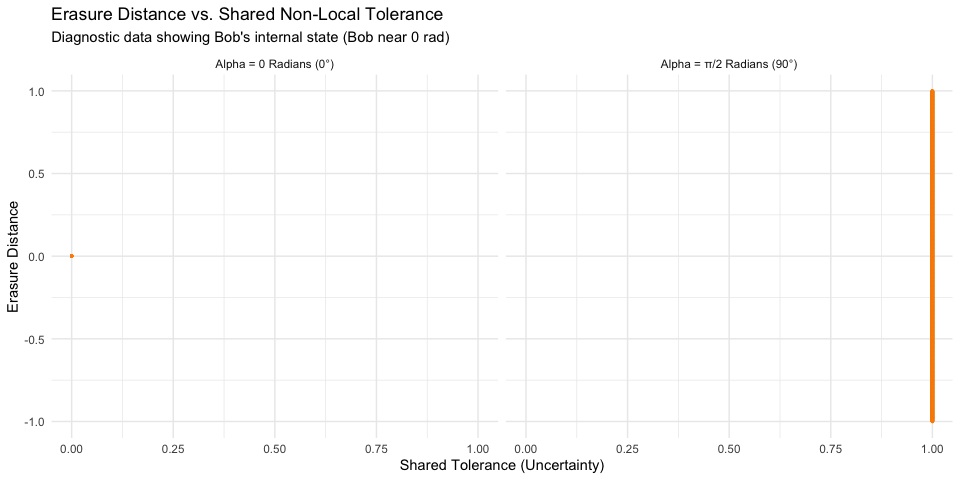
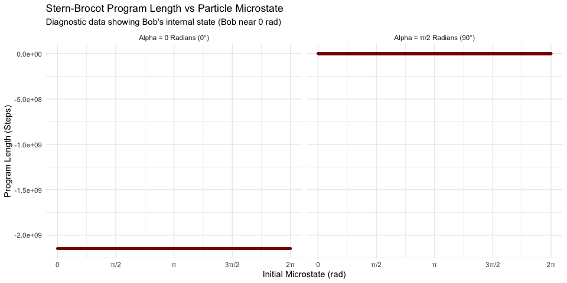
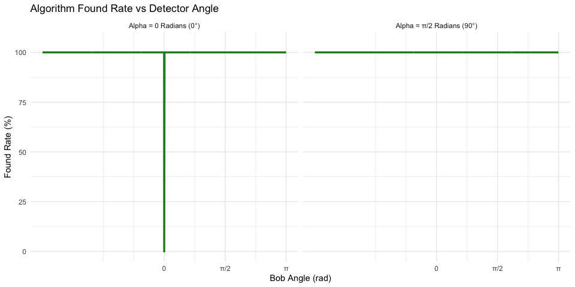
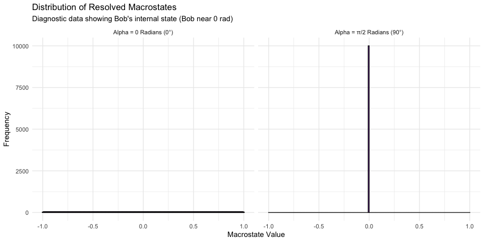
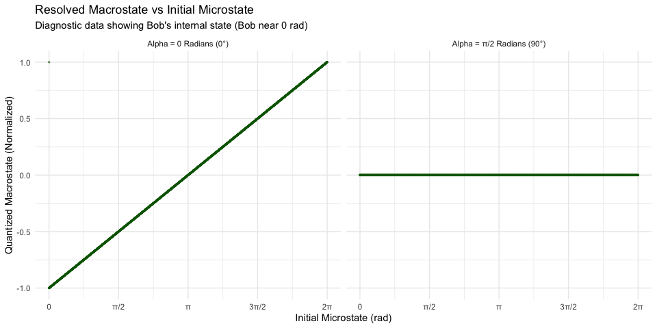
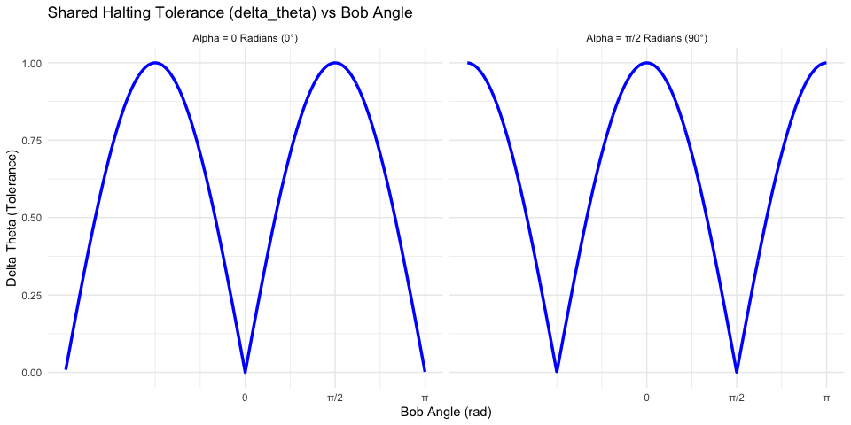

Bell Test: Symplectic Contextual Erasure (Non-Local Dynamic)
================

## Statistical Summary

| Metric                   | Value       |
|:-------------------------|:------------|
| **CHSH S-Value**         | **0.98464** |
| **Classical Limit**      | 2.0         |
| **Quantum Limit**        | 2.828       |
| **Algorithm Found Rate** | **50%**     |

------------------------------------------------------------------------

## Alice Fixed at 0°

Correlation $E(0, \theta_B)$ compared against the quantum
$-\cos(\theta)$ baseline (dashed) and the linear classical baseline
(solid).

<!-- -->

------------------------------------------------------------------------

## Alice Fixed at 90° (π/2)

Correlation plotted against the Phase Difference
$(\theta_B - \theta_A)$.

<!-- -->

### CHSH Breakdown

``` text
E(0,  pi/4):  -0.3282
E(0, 3pi/4):  -0.0003
E(90, pi/4):  -0.3284
E(90, 3pi/4): -0.3283
-----------------------
S-Value:       0.9846
```

------------------------------------------------------------------------

## Erasure Transfer Function

This plot visualizes the internal mathematical “warp” of the contextual
erasure. It shows how the continuous local hidden variable (microstate)
is shifted into its final macroscopic physical distance.

<!-- -->

------------------------------------------------------------------------

## Erasure Distance vs. Uncertainty

This plot visualizes the relationship between the physical shift
required to snap to a rational macrostate (`erasure_distance`) and the
fundamental uncertainty of that resulting state. It reveals the
precision trade-offs inherent in the contextual erasure process.

<!-- -->

------------------------------------------------------------------------

## Algorithmic Complexity of Measurement

This plot reveals the thermodynamic cost of the measurement context. As
the particle’s relative angle changes, the computational effort (program
length) required to map the microstate to a rational Stern-Brocot
macrostate fluctuates in a fractal pattern.

    ## Don't know how to automatically pick scale for object of type <integer64>.
    ## Defaulting to continuous.

<!-- -->

------------------------------------------------------------------------

## Erasure Success Rate

This plot verifies the percentage of microstates successfully resolved
to a rational macrostate before hitting the maximum search depth limit
(`max_depth = 2000`). For the simulation to be valid, this must remain
at 100%.

<!-- -->

------------------------------------------------------------------------

## Quantization into Rational Macrostates

This histogram demonstrates how the contextual erasure acts as a fractal
attractor, quantizing the uniform continuous microstates into discrete
rational fractions on the Stern-Brocot tree.

<!-- -->

## Macrostate vs. Initial Microstate

This plot maps the initial continuous hidden variable (microstate)
directly to the resolved Stern-Brocot fraction (macrostate).

<!-- -->

------------------------------------------------------------------------

## Non-Local Action Boundary vs Detector Angle

This plot maps the shared thermodynamic boundary (`delta_theta`) as Bob
rotates his measurement apparatus, demonstrating how the potential
action limits pulse relative to the fixed context of Alice’s magnet.

<!-- -->
