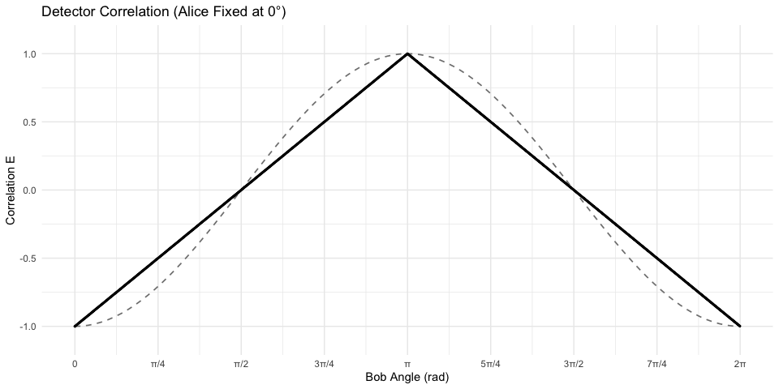
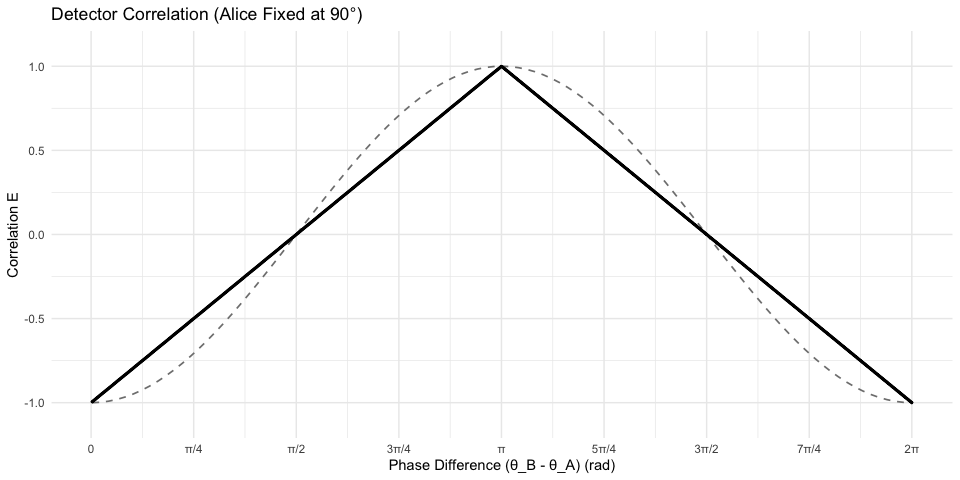

Bell Test: Symplectic Contextual Erasure
================

## Statistical Summary

| Metric              | Value |
|:--------------------|:------|
| **CHSH S-Value**    | **2** |
| **Classical Limit** | 2.0   |
| **Quantum Limit**   | 2.828 |

------------------------------------------------------------------------

## Alice Fixed at 0°

Correlation $E(0, \theta_B)$ compared against the quantum
$-\cos(\theta)$ baseline (dashed) and the linear classical baseline
(solid).

<!-- -->

------------------------------------------------------------------------

## Alice Fixed at 90° (π/2)

Correlation plotted against the Phase Difference
$(\theta_B - \theta_A)$.

<!-- -->

### CHSH Breakdown

``` text
E(0,  pi/4):  -0.5001
E(0, 3pi/4):   0.5000
E(90, pi/4):  -0.4997
E(90, 3pi/4): -0.5002
-----------------------
S-Value:       2.0000
```
