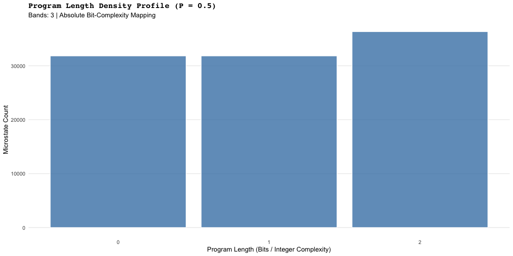
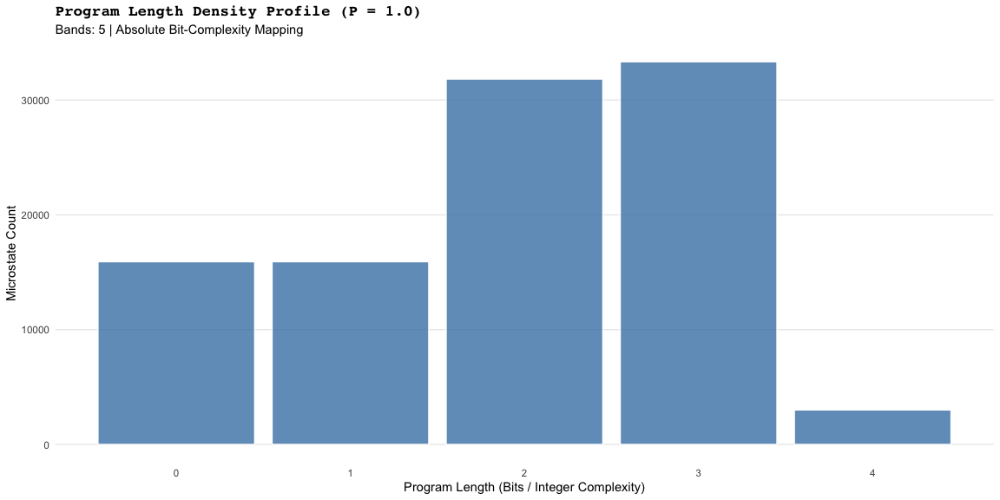
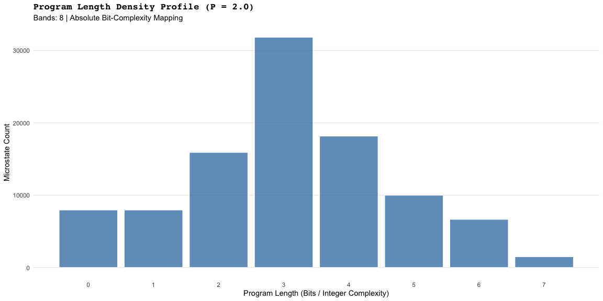
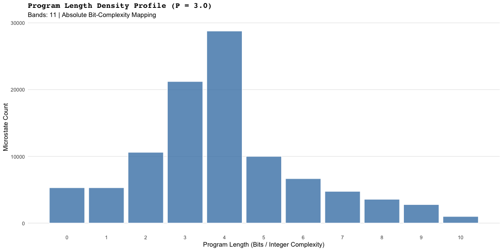
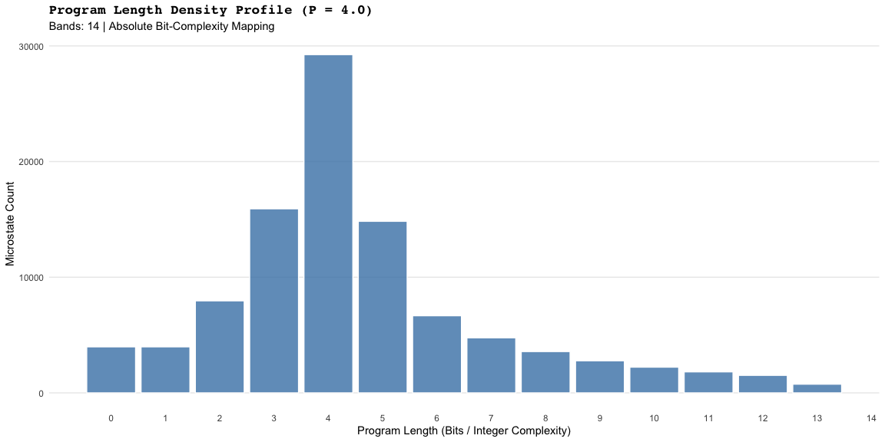

Stern-Brocot Physics: Program Length Complexity
================

# Stern-Brocot Physics: Complexity Metric

This report visualizes the density distribution of algorithmic
complexity (Program Length). Instead of applying continuous momentum
scaling, we are mapping the raw integer bit-counts to identify the
discrete “harmonic” bands where the Stern-Brocot tree search identifies
microstates of equivalent complexity.

------------------------------------------------------------------------

<!-- -->

------------------------------------------------------------------------

<!-- -->

------------------------------------------------------------------------

<!-- -->

------------------------------------------------------------------------

<!-- -->

------------------------------------------------------------------------

<!-- -->

------------------------------------------------------------------------
