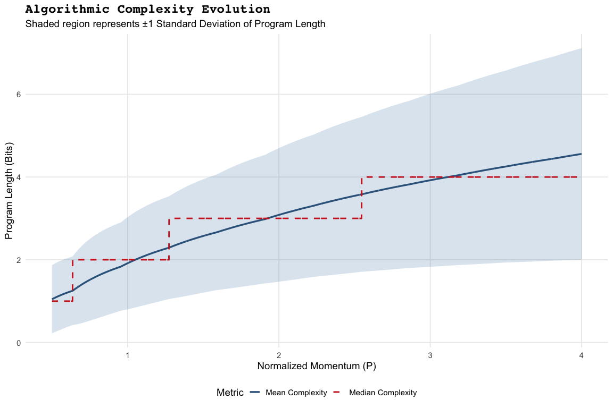

Stern-Brocot Physics: Program Length Complexity Evolution
================

- [Complexity Evolution Analysis](#complexity-evolution-analysis)
  - [Program Length Scaling](#program-length-scaling)
  - [Statistical Insights](#statistical-insights)
    - [1. Scaling Law](#1-scaling-law)
    - [2. Skewness (Mean vs. Median)](#2-skewness-mean-vs-median)
    - [3. Turbulence (Ribbon Width)](#3-turbulence-ribbon-width)

# Complexity Evolution Analysis

This report visualizes how the algorithmic complexity (Program Length)
scales as a function of Normalized Momentum ($P$). By analyzing the
Mean, Median, and Standard Deviation (Spread), we can identify phase
transitions and scaling laws inherent in the Stern-Brocot search space.

------------------------------------------------------------------------

## Program Length Scaling

The plot below illustrates the “Action Canvas” thickening. The **Mean**
and **Median** tracks show the central tendency of the search depth,
while the **Ribbon** indicates the statistical spread (uncertainty) of
the program lengths.

<!-- -->

------------------------------------------------------------------------

## Statistical Insights

### 1. Scaling Law

By observing the curvature of the Mean Complexity, we can determine the
search efficiency: \* **Linear Growth**: Suggests a constant complexity
cost per momentum unit. \* **Logarithmic Growth**: Suggests an extremely
efficient search where complexity plateaus. \* **Quadratic Growth**:
Indicates a significant “complexity explosion” at high energy levels.

### 2. Skewness (Mean vs. Median)

- If the **Mean** (Blue) stays above the **Median** (Red), the
  distribution is “Right-Skewed,” meaning a small number of paths are
  significantly more complex than the average search.
- If they overlap, the complexity distribution is symmetric and stable.

### 3. Turbulence (Ribbon Width)

A widening of the **blue ribbon** indicates that the Stern-Brocot tree
is branching more aggressively, creating a wider variety of microstate
depths for that specific momentum value.

------------------------------------------------------------------------
