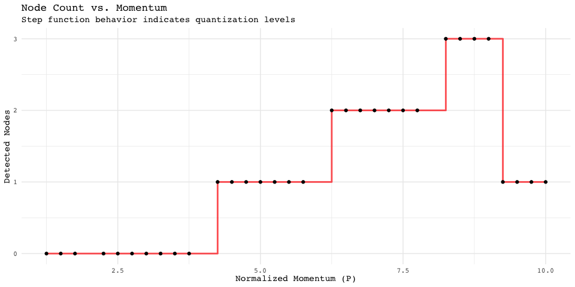
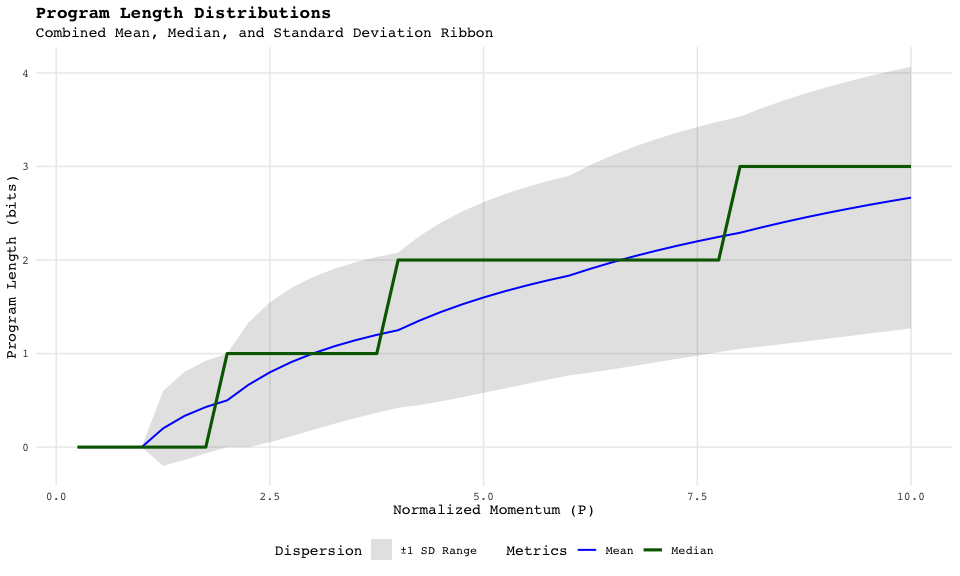
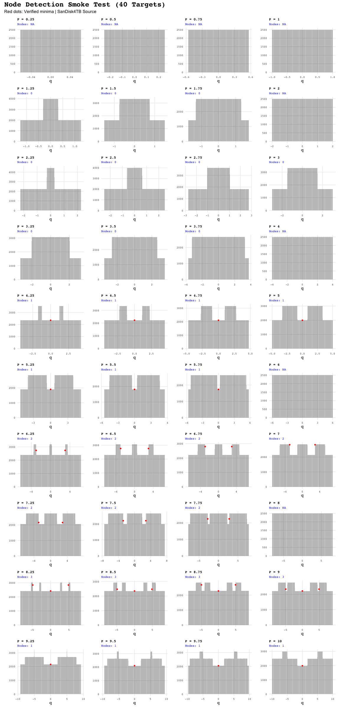

Stern-Brocot Physics
================

# Smoke Test: Quantum Harmonic Oscillator Analysis

## 1. Physical Quantization: Nodes vs. Momentum

This plot verifies the relationship between the momentum ($P$) and the
number of detected physical nodes.

<!-- --> \## 2. Program
Length Statistics (Consolidated) Analysis of program lengths showing the
central tendency (Mean/Median) and the dispersion (±1 SD Ribbon).

<!-- -->

## 3. Node Detection Audit (Histograms)

Verification of tracked minima (red dots) and central trough correction
($x=0$).

<!-- -->
